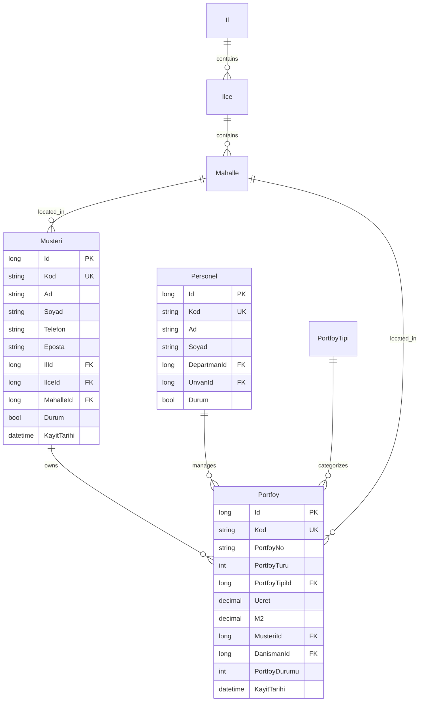
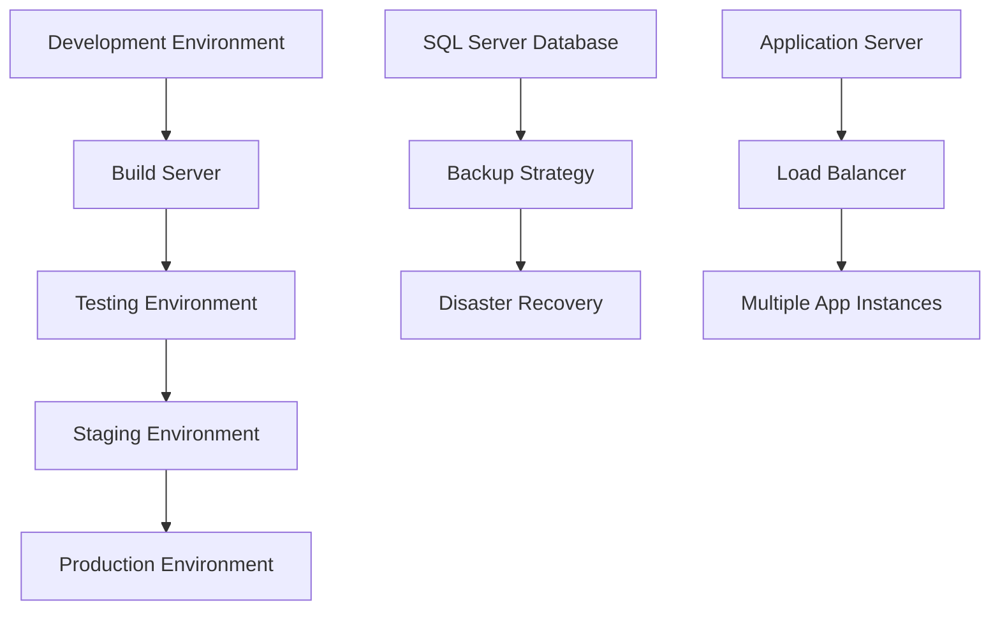
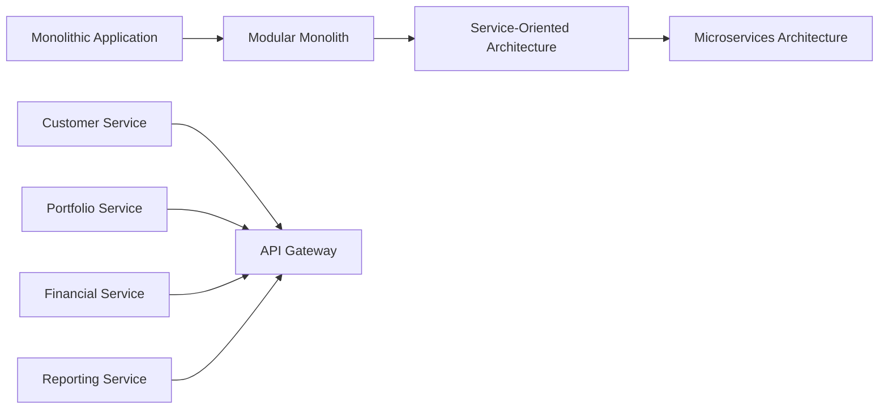

# Design Document

## Overview

Bu doküman, emlak yönetim sisteminin teknik tasarımını detaylandırır. Sistem, mevcut N-Tier (Katmanlı) mimarisi üzerine inşa edilmiş olup, Entity Framework Code First yaklaşımı ile SQL Server veritabanı kullanmaktadır. Tasarım, SOLID prensipleri ve Repository Pattern'i takip ederek genişletilebilir ve sürdürülebilir bir yapı sunar.

## Architecture

### Current Architecture Overview

Sistem 6 katmanlı mimari ile tasarlanmıştır:

```
┌─────────────────────────────────────┐
│     Presentation Layer              │
│  (AdvancedSoftware.UI.Win)         │
└─────────────────────────────────────┘
                    │
┌─────────────────────────────────────┐
│     Business Layer                  │
│  (AdvancedSoftware.BusinessLayer)  │
└─────────────────────────────────────┘
                    │
┌─────────────────────────────────────┐
│   Data Access Layer                 │
│ (AdvancedSoftware.DataAccessLayer) │
└─────────────────────────────────────┘
                    │
┌─────────────────────────────────────┐
│      Data Layer                     │
│   (AdvancedSoftware.Data)          │
└─────────────────────────────────────┘
                    │
┌─────────────────────────────────────┐
│      Model Layer                    │
│ (AdvancedSoftware.Model)           │
└─────────────────────────────────────┘
                    │
┌─────────────────────────────────────┐
│     Common Layer                    │
│  (AdvancedSoftware.Common)         │
└─────────────────────────────────────┘
```

### Architectural Patterns

1. **Repository Pattern**: Generic repository implementation for data access
2. **Unit of Work Pattern**: Transaction management and data consistency
3. **DTO Pattern**: Data transfer objects for layer communication
4. **Base Entity Pattern**: Common properties and behaviors
5. **Dependency Injection**: Loose coupling between layers

## Components and Interfaces

### 1. Model Layer (Domain Layer)

#### Base Entities
```csharp
// Base entity with common properties
public abstract class BaseEntity : IBaseEntity
{
    public long Id { get; set; }
    public string Kod { get; set; }
}

// Base entity with status tracking
public abstract class BaseEntityDurum : BaseEntity
{
    public bool Durum { get; set; }
    public DateTime KayitTarihi { get; set; }
    public DateTime? GuncellemeTarihi { get; set; }
}

// Base entity for transactional records
public abstract class BaseHareketEntity : BaseEntity
{
    public DateTime Tarih { get; set; }
    public string Aciklama { get; set; }
}
```

#### Core Domain Entities

**Customer Management**
```csharp
public class Musteri : BaseEntityDurum
{
    public MusteriTuru MusteriTuru { get; set; }
    public string Ad { get; set; }
    public string Soyad { get; set; }
    public string Telefon { get; set; }
    public string Eposta { get; set; }
    // Location properties
    public long IlId { get; set; }
    public long IlceId { get; set; }
    public long MahalleId { get; set; }
    // Navigation properties
    public virtual Il Il { get; set; }
    public virtual Ilce Ilce { get; set; }
    public virtual Mahalle Mahalle { get; set; }
}
```

**Portfolio Management**
```csharp
public class Portfoy : BaseEntityDurum
{
    public string PortfoyNo { get; set; }
    public PortfoyTuru PortfoyTuru { get; set; }
    public long PortfoyTipiId { get; set; }
    public decimal Ucret { get; set; }
    public decimal M2 { get; set; }
    public long MusteriId { get; set; }
    public long DanismanId { get; set; }
    public PortfoyDurumu PortfoyDurumu { get; set; }
    // Navigation properties
    public virtual Musteri Musteri { get; set; }
    public virtual Personel Danisman { get; set; }
    public virtual PortfoyTipi PortfoyTipi { get; set; }
}
```

### 2. Data Access Layer

#### Generic Repository Interface
```csharp
public interface IRepository<T> : IDisposable where T : class
{
    // CRUD Operations
    void Insert(T entity);
    void Insert(IEnumerable<T> entities);
    void Update(T entity);
    void Update(T entity, IEnumerable<string> fields);
    void Delete(T entity);
    void Delete(IEnumerable<T> entities);
    
    // Query Operations
    TResult Find<TResult>(Expression<Func<T, bool>> filter, 
                         Expression<Func<T, TResult>> selector);
    IQueryable<TResult> Select<TResult>(Expression<Func<T, bool>> filter, 
                                       Expression<Func<T, TResult>> selector);
    int Count(Expression<Func<T, bool>> filter = null);
    
    // Business Logic
    string YeniKodver(KartTuru kartTuru, Expression<Func<T, string>> filter, 
                     Expression<Func<T, bool>> where = null);
}
```

#### Unit of Work Interface
```csharp
public interface IUnitOfWork : IDisposable
{
    IRepository<T> Repository<T>() where T : class;
    int Save();
    Task<int> SaveAsync();
    void BeginTransaction();
    void Commit();
    void Rollback();
}
```

### 3. Business Layer

#### Service Interfaces
```csharp
public interface IMusteriService
{
    Task<MusteriDto> GetByIdAsync(long id);
    Task<IEnumerable<MusteriDto>> GetAllAsync();
    Task<MusteriDto> CreateAsync(MusteriDto musteriDto);
    Task<MusteriDto> UpdateAsync(MusteriDto musteriDto);
    Task<bool> DeleteAsync(long id);
    Task<IEnumerable<MusteriDto>> SearchAsync(MusteriSearchCriteria criteria);
}

public interface IPortfoyService
{
    Task<PortfoyDto> GetByIdAsync(long id);
    Task<IEnumerable<PortfoyDto>> GetAllAsync();
    Task<PortfoyDto> CreateAsync(PortfoyDto portfoyDto);
    Task<PortfoyDto> UpdateAsync(PortfoyDto portfoyDto);
    Task<bool> DeleteAsync(long id);
    Task<IEnumerable<PortfoyDto>> GetByDanismanAsync(long danismanId);
    Task<IEnumerable<PortfoyDto>> SearchAsync(PortfoySearchCriteria criteria);
}
```

### 4. Presentation Layer

#### Base Form Architecture
```csharp
public abstract class BaseForm : Form
{
    protected virtual void InitializeComponent();
    protected virtual void LoadData();
    protected virtual void SaveData();
    protected virtual void DeleteData();
    protected virtual void RefreshData();
    protected virtual bool ValidateForm();
    protected virtual void ShowMessage(string message, MessageType type);
}

public abstract class BaseListForm<T> : BaseForm where T : class
{
    protected virtual void LoadList();
    protected virtual void FilterList();
    protected virtual void ExportToExcel();
    protected virtual void ShowAddForm();
    protected virtual void ShowEditForm();
}
```

## Data Models

### Database Schema Design

#### Core Tables Structure



### Data Transfer Objects (DTOs)

```csharp
public class MusteriDto
{
    public long Id { get; set; }
    public string Kod { get; set; }
    public string Ad { get; set; }
    public string Soyad { get; set; }
    public string AdSoyad => $"{Ad} {Soyad}";
    public string Telefon { get; set; }
    public string Eposta { get; set; }
    public MusteriTuru MusteriTuru { get; set; }
    public string IlAdi { get; set; }
    public string IlceAdi { get; set; }
    public string MahalleAdi { get; set; }
    public bool Durum { get; set; }
}

public class PortfoyDto
{
    public long Id { get; set; }
    public string Kod { get; set; }
    public string PortfoyNo { get; set; }
    public PortfoyTuru PortfoyTuru { get; set; }
    public string PortfoyTipiAdi { get; set; }
    public decimal Ucret { get; set; }
    public decimal M2 { get; set; }
    public string MusteriAdi { get; set; }
    public string DanismanAdi { get; set; }
    public PortfoyDurumu PortfoyDurumu { get; set; }
    public string Lokasyon { get; set; }
    public DateTime KayitTarihi { get; set; }
}
```

## Error Handling

### Exception Handling Strategy

```csharp
public class BusinessException : Exception
{
    public string ErrorCode { get; }
    public BusinessException(string errorCode, string message) : base(message)
    {
        ErrorCode = errorCode;
    }
}

public class ValidationException : BusinessException
{
    public Dictionary<string, string> ValidationErrors { get; }
    public ValidationException(Dictionary<string, string> errors) 
        : base("VALIDATION_ERROR", "Validation failed")
    {
        ValidationErrors = errors;
    }
}

public class GlobalExceptionHandler
{
    public static void HandleException(Exception ex)
    {
        switch (ex)
        {
            case ValidationException validationEx:
                ShowValidationErrors(validationEx.ValidationErrors);
                break;
            case BusinessException businessEx:
                ShowBusinessError(businessEx.Message);
                break;
            case SqlException sqlEx:
                LogDatabaseError(sqlEx);
                ShowGenericError("Database error occurred");
                break;
            default:
                LogUnhandledException(ex);
                ShowGenericError("An unexpected error occurred");
                break;
        }
    }
}
```

### Validation Framework

```csharp
public interface IValidator<T>
{
    ValidationResult Validate(T entity);
}

public class MusteriValidator : IValidator<Musteri>
{
    public ValidationResult Validate(Musteri musteri)
    {
        var result = new ValidationResult();
        
        if (string.IsNullOrEmpty(musteri.Ad))
            result.AddError("Ad", "Müşteri adı zorunludur");
            
        if (string.IsNullOrEmpty(musteri.Soyad))
            result.AddError("Soyad", "Müşteri soyadı zorunludur");
            
        if (!IsValidEmail(musteri.Eposta))
            result.AddError("Eposta", "Geçerli bir e-posta adresi giriniz");
            
        return result;
    }
}
```

## Testing Strategy

### Unit Testing Architecture

```csharp
[TestClass]
public class MusteriServiceTests
{
    private Mock<IUnitOfWork> _mockUnitOfWork;
    private Mock<IRepository<Musteri>> _mockRepository;
    private MusteriService _musteriService;
    
    [TestInitialize]
    public void Setup()
    {
        _mockUnitOfWork = new Mock<IUnitOfWork>();
        _mockRepository = new Mock<IRepository<Musteri>>();
        _mockUnitOfWork.Setup(x => x.Repository<Musteri>()).Returns(_mockRepository.Object);
        _musteriService = new MusteriService(_mockUnitOfWork.Object);
    }
    
    [TestMethod]
    public async Task CreateAsync_ValidMusteri_ReturnsCreatedMusteri()
    {
        // Arrange
        var musteriDto = new MusteriDto { Ad = "Test", Soyad = "User" };
        
        // Act
        var result = await _musteriService.CreateAsync(musteriDto);
        
        // Assert
        Assert.IsNotNull(result);
        Assert.AreEqual("Test", result.Ad);
        _mockRepository.Verify(x => x.Insert(It.IsAny<Musteri>()), Times.Once);
    }
}
```

### Integration Testing

```csharp
[TestClass]
public class DatabaseIntegrationTests
{
    private DataContext _context;
    
    [TestInitialize]
    public void Setup()
    {
        var options = new DbContextOptionsBuilder<DataContext>()
            .UseInMemoryDatabase(databaseName: Guid.NewGuid().ToString())
            .Options;
        _context = new DataContext(options);
    }
    
    [TestMethod]
    public void CanCreateAndRetrieveMusteri()
    {
        // Arrange
        var musteri = new Musteri { Ad = "Test", Soyad = "User", Kod = "MST-001" };
        
        // Act
        _context.Musteri.Add(musteri);
        _context.SaveChanges();
        var retrieved = _context.Musteri.FirstOrDefault(x => x.Kod == "MST-001");
        
        // Assert
        Assert.IsNotNull(retrieved);
        Assert.AreEqual("Test", retrieved.Ad);
    }
}
```

## Security Considerations

### Authentication and Authorization

```csharp
public interface IAuthenticationService
{
    Task<AuthenticationResult> AuthenticateAsync(string username, string password);
    Task<bool> ValidateTokenAsync(string token);
    Task LogoutAsync(string token);
}

public interface IAuthorizationService
{
    Task<bool> HasPermissionAsync(string userId, string permission);
    Task<bool> CanAccessResourceAsync(string userId, string resourceType, long resourceId);
}

public class SecurityAttribute : Attribute
{
    public string Permission { get; }
    public SecurityAttribute(string permission)
    {
        Permission = permission;
    }
}
```

### Data Protection

```csharp
public interface IDataProtectionService
{
    string Encrypt(string plainText);
    string Decrypt(string cipherText);
    string Hash(string input);
    bool VerifyHash(string input, string hash);
}

public class AuditLog
{
    public long Id { get; set; }
    public string UserId { get; set; }
    public string Action { get; set; }
    public string EntityType { get; set; }
    public long EntityId { get; set; }
    public string OldValues { get; set; }
    public string NewValues { get; set; }
    public DateTime Timestamp { get; set; }
}
```

## Performance Optimization

### Caching Strategy

```csharp
public interface ICacheService
{
    Task<T> GetAsync<T>(string key);
    Task SetAsync<T>(string key, T value, TimeSpan expiration);
    Task RemoveAsync(string key);
    Task RemovePatternAsync(string pattern);
}

public class CacheKeys
{
    public static string MusteriList => "musteri:list";
    public static string PortfoyList => "portfoy:list";
    public static string LokasyonHierarchy => "lokasyon:hierarchy";
}
```

### Database Optimization

```csharp
// Optimized queries with proper indexing
public class OptimizedQueries
{
    public async Task<IEnumerable<PortfoyDto>> GetPortfoyWithFiltersAsync(
        PortfoySearchCriteria criteria)
    {
        return await _context.Portfoy
            .Where(p => p.Durum == true)
            .Where(p => criteria.IlId == null || p.IlId == criteria.IlId)
            .Where(p => criteria.PortfoyTuru == null || p.PortfoyTuru == criteria.PortfoyTuru)
            .Where(p => criteria.MinUcret == null || p.Ucret >= criteria.MinUcret)
            .Where(p => criteria.MaxUcret == null || p.Ucret <= criteria.MaxUcret)
            .Include(p => p.Musteri)
            .Include(p => p.Danisman)
            .Include(p => p.PortfoyTipi)
            .Select(p => new PortfoyDto
            {
                Id = p.Id,
                Kod = p.Kod,
                PortfoyNo = p.PortfoyNo,
                // ... other properties
            })
            .ToListAsync();
    }
}
```

## Deployment Architecture

### Application Deployment



### Configuration Management

```csharp
public class AppSettings
{
    public string ConnectionString { get; set; }
    public string LogLevel { get; set; }
    public CacheSettings Cache { get; set; }
    public SecuritySettings Security { get; set; }
}

public class CacheSettings
{
    public int DefaultExpirationMinutes { get; set; }
    public string RedisConnectionString { get; set; }
}

public class SecuritySettings
{
    public string EncryptionKey { get; set; }
    public int TokenExpirationMinutes { get; set; }
    public bool EnableAuditLogging { get; set; }
}
```

## Future Enhancements

### Microservices Migration Path



### API Design for Future Integration

```csharp
[ApiController]
[Route("api/[controller]")]
public class MusteriController : ControllerBase
{
    [HttpGet]
    public async Task<ActionResult<IEnumerable<MusteriDto>>> GetAll(
        [FromQuery] MusteriSearchCriteria criteria)
    {
        var result = await _musteriService.SearchAsync(criteria);
        return Ok(result);
    }
    
    [HttpPost]
    public async Task<ActionResult<MusteriDto>> Create([FromBody] MusteriDto musteriDto)
    {
        var result = await _musteriService.CreateAsync(musteriDto);
        return CreatedAtAction(nameof(GetById), new { id = result.Id }, result);
    }
}
```

Bu tasarım dokümanı, mevcut sistemin güçlü yanlarını koruyarak, modern yazılım geliştirme pratiklerini entegre eden kapsamlı bir yaklaşım sunar. Sistem, genişletilebilirlik, sürdürülebilirlik ve performans açısından optimize edilmiştir.